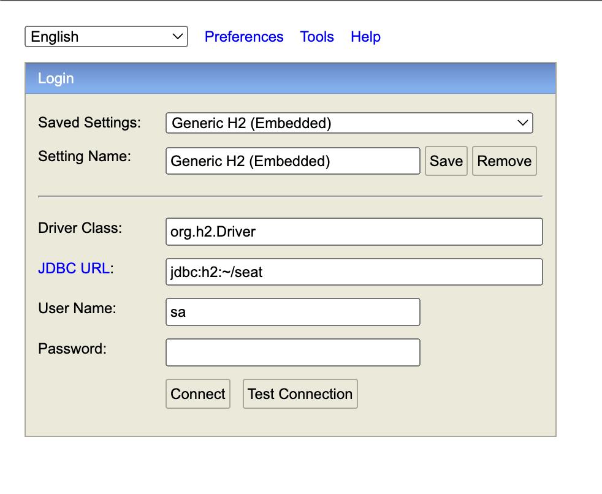

# 다중 이용 시설의 효율적인 좌석 관리 서비스

## NOW U SEAT ME

>  프로젝트 기간: 2022.11 - 2022.12.2<br>
> 팀명 : BINARY ESG <br>
> 팀원 : 이진수, 이정민, 이현규, 박상규, 정지윤

<br>

--------

<br>

### 1. 진행 방법
 
1. JAVA11(필수), Python(필수), Git(필수), IntelliJ(권장)를 버전에 맞게 설치<br>
오른쪽의 링크를 통해 다운로드 가능 --
[다운로드 링크](https://drive.google.com/drive/folders/1oitvIpHet7atcvQY0g3Xx4U4xmP1Xmzh?usp=share_link)

2. git clone <br>
```git clone https://github.com/LeeJinSoo-BIN/BINARY-ESG.git```

3. 아래의 코드를 통해 필요한 라이브러리 추가 설치(pip가 설치되어있다고 가정)<br>
```setup.sh``` (window)<br>
 ```sh setup.sh``` (linux)


4. 아래의 코드를 통해 flask를 실행 <br>
```python3 model/detector/binary_esg_flask.py```

5. 아래의 코드를 통해 H2를 실행 후 사진처럼 JDBC URL 정보 설정 후 연결 <br>
```DB/h2/bin/h2.sh``` (window)<br>
 ```sh DB/h2/bin/h2.sh``` (linux)

	
<br>

6. clone 받은 폴더 안의 ```back-end``` 폴더를 spring boot를 통해 Open 후 ```ESGApplication``` 실행

<br>


### 2. 개발 환경 

|| tool |
| ------ | ------ |
| 개발언어 |    |
| 데이터베이스 |  |
| 웹 서버 |      |
| 모델 서버 |   |
| 모델학습 환경 | NVIDIA-SMI 450.66 <br> Driver Version: 450.66 <br> CUDA Version: 11.0 <br> GeForce RTX 2080 Ti |
| 개발환경 | Windows10 64bit <br> Ubuntu 18.04.2 LTS |


<br>

### 3. 시스템 구성도


<br>

### 4. 서비스 흐름도


