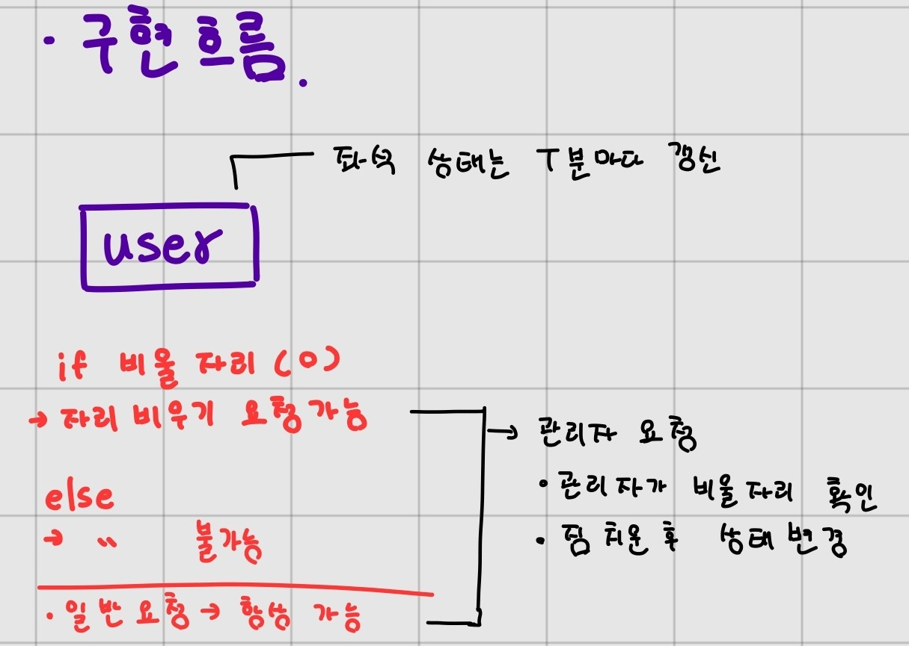

## WEB - 22.11.08 회의록 

------------------------------- 

> DB : h2 
>   모델 학습 정보 받아오기 : flask
>   웹페이지 서버 구축 : spring boot

 

< 일주일 진행 계획 >

현규
- flask - spring boot 통신
- DB 구축 및 데이터 추출

정민
- flask - spring boot 통신
- flask 모델 학습 결과 받아오기

상규
- 프론트엔드 구현 진행

------------------------------- 
 

### 프론트엔드 디자인
    

    

------------------------------- 
   

### 구현 서비스 설계

    

