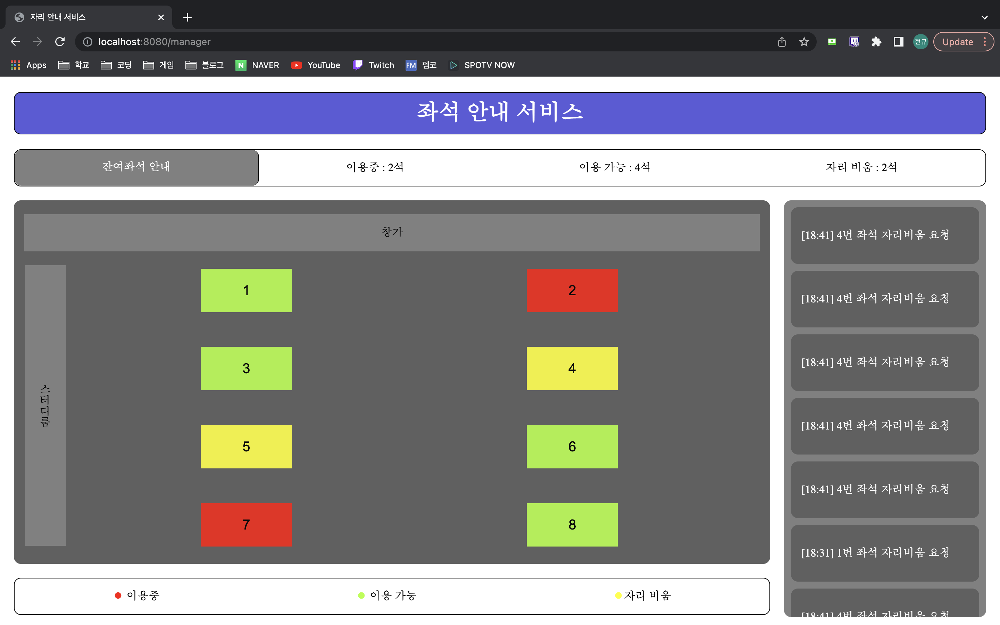

## 22.11.20 회의록 

------------------------------- 

> DB : h2 
> <br> 모델 학습 정보 받아오기 : flask
> <br> 웹페이지 서버 구축 : spring boot

<br>

## 진행 상황

모델 - 진수, 지윤, 정민
- mmdetection 라이브러리 사용 (진수, 지윤)
```
  사용할 모델 선택을 위해 내장 되어있는 모델을 정리중
  pytorch로 구현된 모델 사용할 예정
  현재 후보는 YOLOX, TOOD

  사전 학습 모델을 선택 후 추가 학습 실행 예정
``` 
- 학습을 위한 데이터 수집 (진수, 지윤)
```
  현재 학습을 위한 데이터로 자리를 비추는 영상이 필요하여 창의토론라운지 특정 좌석에 대한 동영상 촬영
  각 데이터에 대한 이미지 데이터 라벨링(Bounding Box 정보가 포함된 어노테이션 파일 생성)
``` 
- NMS(Non-maximum suppression) (정민)
```
  의사 코드와 예시 코드를 참고하여 코드를 어느정도 작성한 상태
  하지만 동일한 사진에 대해서 포함관계를 가지는 박스가 있다고 가정했을 때 둘의 겹치는 영역이 작다면 IoU 값이 작게 나오는 것을 확인
``` 
<br>

프론트엔드 - 상규, 지윤
- 사용자 웹 화면 구현
```
1. 잔여좌석 안내 
  각 자리의 상태를 색깔별로 시각화
  (이용중, 이용가능, 자리비움)
2. 자리 비움 요청 인라인 팝업창
``` 


- 관리자 알림창 구현
```
  스크롤이 가능한 알림창 디자인 틀 구현
``` 


<br>

백엔드 - 현규, 정민
- Spring Boot (현규)
	- 서비스 기능 구현
		```
		로그인 / 회원가입 
		사용자, 관리자 페이지 매핑
		자리 상태 카운트
		``` 
	- 타임리프로 백엔드 서버에서 HTML을 동적으로 렌더링


- Flask (정민)
	```
	flask를 사용하여 pytorch로 작성된 모델을 rest api로 배포하는 예시 코드 공부 
	``` 


------------------------------- 
<br>  

< 일주일 진행 계획 >

진수
- 모델 최종 선정
- 추가 학습 실행

현규
- 사용자가 자리 비움 요청 시 관리자에게 알림 전송
- 관리자가 특정 자리의 정보를 이용중 상태로 변경할 경우 그 자리에 대한 알림 삭제 및 DB 상태 업데이트

정민, 지윤
- 판넬 구상 (12/1 제출)

상규, 지윤
- 데이터 수집
- 데이터 라벨링

------------------------------- 
<br>

### Q. 수집하는 데이터가 항공샷이 아니기 때문에 사람 bbox와 책상 bbox의 거리로 자리 상태를 판단하기가 어려울 것 같은데 이에 대한 해결방안? 
``` 
학습 bbox 라벨링을 변경
1. 사람이 있는 자리 (이용중)
2. 사람은 없지만 짐이 있는 자리 (자리 비움)
3. 빈 자리 (사용가능)

또한 데이터를 추가적으로 수집할 필요가 보임

이렇게 학습된 결과를 내뱉을 시 NMS를 통해 책상에 대한 box를 책상 개수만큼 남긴 후
번호를 매겨서 백엔드로 자리 번호 및 자리 상태를 전달하는 것이 좋을 것 같다.
``` 
<br>

### Q. 관리자 자리 비움 요청 알림의 위치?
``` 
알림창에서 먼저 도착한 알림이 위에 있어야 하는 것으로 결정
우선순위가 먼저 요청한 사람에게 있다고 판단
또한 요청한 자리 상태가 변경될 시 알림이 삭제되도록 구현할 것이기 때문에 괜찮을 것 같다.
``` 
